# imageright-mcp

An [MCP](https://modelcontextprotocol.io) server that helps AI coding assistants work correctly against
Vertafore ImageRight on your product version (24.x, 25.x, or 7.2).

> **Status: pre-alpha (phase 2 complete: 24 tools — 15 API explorer + 9 composite workflow tools; 802
> tests green).** The offline API explorer, version-matrix tools, error catalog, the version-aware client
> (`ir_call`, with dry-run previews) and the composite workflow tools work. Capability param mappings are
> not yet verified against a live server; hardening and a live smoke suite follow in M7.

## What is this?

ImageRight has three API surfaces: REST v1, REST v2 and SOAP. Which operations each one offers
depends on your version (24.x, 25.x or 7.2). This MCP server gives you one consistent interface
instead. It sends each call to the right surface for the version you configured, and it collapses
about 230 native error codes into 75 stable IR codes.

ImageRight stores content in five levels:


- **Drawer**: a top-level cabinet.
- **File**: a case or policy container inside a drawer.
- **Folder**: organizes documents inside a file. Documents always live under a folder, never directly in a file.
- **Document**: metadata plus pages.
- **Page**: one scanned image.

A **composite tool** is one tool that runs a whole multi-step flow for you. It looks up IDs from
names, creates missing parents and uploads pages, so you don't have to chain API calls by hand.

## Quickstart

1. **Install** the server (see [Install](#install)).
2. **Configure** with `ir_configure`: your server URL and version. Credentials stay in environment variables (see [Configuration](#configuration)).
3. **Check** with `ir_test_connection`: is the server reachable, does login work, and does the version match?
4. **Explore** with `ir_search_apis` to find operations, then `ir_describe_api` to understand one.
5. **Act** with `ir_call` for a single API, or with a composite tool such as `ir_upload_document` for a whole workflow.

## Section 1 — Explore

These tools work offline. You don't need a server or credentials.


**`ir_search_apis`**: find the right API using plain words.


**`ir_list_areas`**: see how the API is organized. An area is a group of operations that do
related work. The catalog has 487 operations in 21 areas (20 on 24.x and 7.2), for example Pages
(52 operations), Tasks (58), Drawers (11) and Notes (9). The tool lists every area with its
operation count on each surface (REST v1, REST v2, SOAP).

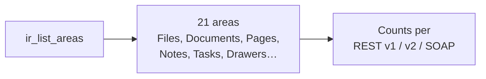

**`ir_describe_api`**: one operation, fully explained: parameters, body, response, errors, gotchas and versions.

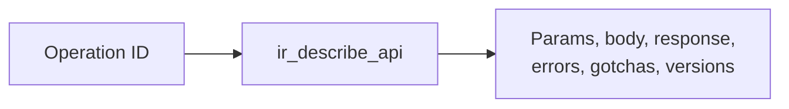

**`ir_describe_type`**: a data shape: its fields and how they differ by version.


**`ir_check_availability`**: is this operation, parameter or field present in 24.x? 25.x? 7.2?


**`ir_compare_versions`**: compare two versions and see which operations were added, removed or changed.

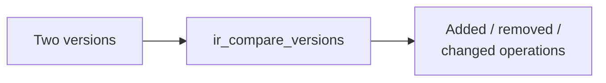

**`ir_list_deprecations`**: deprecated operations and what to use instead.


**`ir_explain_error`**: give it an IR code, an HTTP status or SOAP fault text, and it tells you what it means and what to do.

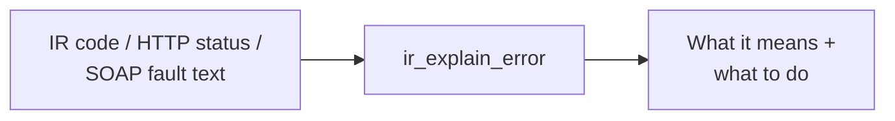

**`ir_list_flows`** / **`ir_describe_flow`**: 17 multi-step recipes (F1–F16, plus F8b). Describe
one flow to see its steps, inputs and errors.

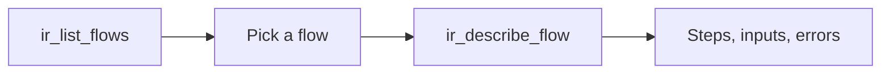

**`ir_get_config`**: every setting and where its value came from, with secrets hidden.

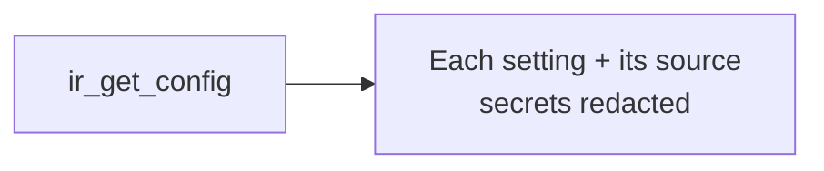

## Section 2 — Client

These tools talk to your ImageRight server.

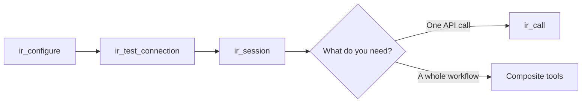

**`ir_configure`**: save the URL, version, writeMode and other settings. Secrets stay in environment variables.

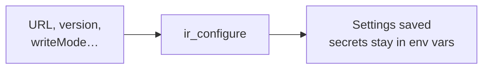

**`ir_test_connection`**: is the server reachable? Does login work? Does the server's version match the one you configured?

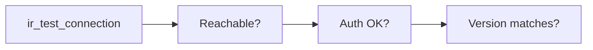

**`ir_session`**: log in, check status, or log out.


**`ir_call`**: call any single operation by its ID. Dry-run shows you the request instead of
sending it. Results come back in the same standard shapes whichever surface answered.

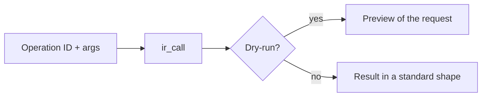

**`ir_search_files`**: find files by number or a `%` pattern, by drawer, and by temporary or deleted state.

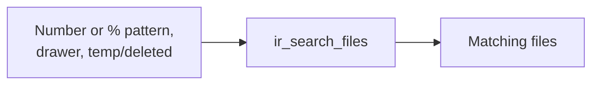

**`ir_create_file`**: creates a file in a drawer, refusing a number that's already taken.

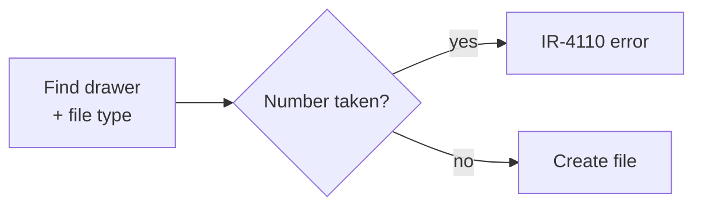

**`ir_update_file`**: changes a file's number and/or description.

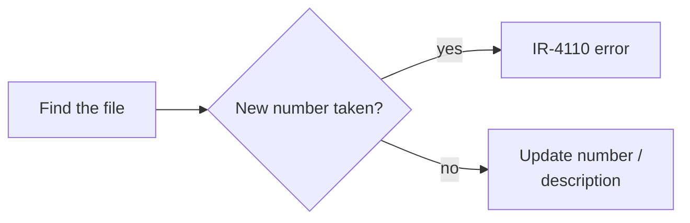

**`ir_merge_files`**: merges one file into another. This is destructive: the source file is gone afterwards.

```mermaid
flowchart LR
  A[Preview] --> B[You confirm] --> C[Merge<br/>source file is gone]
```

**`ir_move_file_content`**: moves or copies documents from one file into a folder of another file.

```mermaid
flowchart LR
  A[Find documents<br/>in source file] --> B[Move or copy each<br/>into target folder] --> C[Report per document<br/>failures listed]
```

**`ir_find_documents`**: lists a file's documents, filtered by folder, type code or part of the description.

```mermaid
flowchart LR
  A[File + filters:<br/>folder, type code,<br/>description text] --> B[ir_find_documents] --> C[Matching documents]
```

**`ir_create_document`**: creates a document in a folder.

```mermaid
flowchart LR
  A{File / folder<br/>exists?} -->|missing + forceCreate| B[Create it]
  A -->|missing, no forceCreate| C[IR-4001 error]
  A -->|exists| D[Create document<br/>in the folder]
  B --> D
```

**`ir_upload_document`**: uploads a local PDF as a new document.

```mermaid
flowchart LR
  A[Find or create file,<br/>folder, document] --> B[Split PDF<br/>into page images] --> C[Upload pages<br/>in order]
```

**`ir_create_task`**: creates a workflow task on a file or on one document.

```mermaid
flowchart LR
  A[Look up workflow, step,<br/>file IDs from names] --> B[If a document:<br/>find it in the folder] --> C[Create the task]
```

**Safety.** Writes default to dry-run previews. Destructive operations need your confirmation. When
a tool needs something from you, it returns a `needs-input` response with the question, never a
bare error.

**Errors.** Every failure carries a stable IR code, plus the server's original detail in
`error.native` (`null` when the error happened locally). See [Errors](#errors).

## Errors

Every tool returns the same envelope: `{ok, data, error, meta}`. Failures carry a stable
`IR-CNNN` code (`data/errors/registry.json`) that says what to do next: about 230 native ImageRight error
codes collapse into 75 IR codes, and the native detail is kept in `error.native`. Codes are append-only:
never renumbered, renamed or reused. Arguments that fail the tool's input schema are rejected by the MCP SDK
before the handler runs, so they come back as a plain-text error without the envelope.

## Install

```bash
pip install imageright-mcp   # not published yet; for now: pip install -e ".[dev]"
```

## Run

The server speaks MCP over stdio:

```bash
imageright-mcp
```

Claude Code:

```bash
claude mcp add imageright -e IMAGERIGHT_VERSION=24.x -- imageright-mcp
```

## Configuration

Values come from environment variables first, then an optional JSON config file, then built-in defaults.
`ir_get_config` reports the effective value of each setting and where it came from.

| Setting | Env var | Default |
|---|---|---|
| `irVersion` | `IMAGERIGHT_VERSION` | `24.x` |
| `restBaseUrl` | `IMAGERIGHT_REST_BASE_URL` | none |
| `soapUrl` | `IMAGERIGHT_SOAP_URL` | none |
| `authMode` | `IMAGERIGHT_AUTH_MODE` (`password` \| `jwt` \| `saml`) | `password` |
| `surfacePreference` | `IMAGERIGHT_SURFACE_PREFERENCE` (comma-separated) | `rest-v2,rest-v1,soap` |
| `writeMode` | `IMAGERIGHT_WRITE_MODE` (`deny` \| `dry-run` \| `allow`) | `dry-run` |
| `dryRun` | `IMAGERIGHT_DRY_RUN` | `false` |
| `username` | `IMAGERIGHT_USERNAME` | none |
| `password` | `IMAGERIGHT_PASSWORD` (env only) | none |
| `jwt` | `IMAGERIGHT_JWT` (env only): a static JWT | none |
| `jwtPrivateKey` | `IMAGERIGHT_JWT_PRIVATE_KEY` (env only): PEM RSA key for self-signed RS256 JWTs | none |
| `jwtPrivateKeyFile` | `IMAGERIGHT_JWT_PRIVATE_KEY_FILE`: path to that key instead | none |
| `jwtSubject` / `jwtIssuer` / `jwtAudience` | `IMAGERIGHT_JWT_SUBJECT` / `_ISSUER` / `_AUDIENCE` (subject defaults to `username`) | none |
| `jwtTtlSeconds` | `IMAGERIGHT_JWT_TTL_SECONDS` | `300` |
| `samlToken` | `IMAGERIGHT_SAML_TOKEN` (env only): base64 SAML token | none |
| `samlTokenCommand` | `IMAGERIGHT_SAML_TOKEN_COMMAND`: command (no shell) that prints a fresh token | none |
| `extraHeaders` | `IMAGERIGHT_EXTRA_HEADERS` (`Header=ENV_VAR,...`): header -> env var holding its value | none |
| `secretEnv` | `IMAGERIGHT_SECRET_ENV` (`password=CORP_PW,...`): read a secret from another env var | none |
| `requireConfirm` | `IMAGERIGHT_REQUIRE_CONFIRM`: destructive calls need `confirm: <previewId>` | `true` |
| `timeoutSeconds` | `IMAGERIGHT_TIMEOUT_SECONDS` | `30` |
| `caBundle` | `IMAGERIGHT_CA_BUNDLE`: PEM bundle for internal CAs | none |
| `verifyTls` | `IMAGERIGHT_VERIFY_TLS` | `true` |
| `requestIdHeader` | `IMAGERIGHT_REQUEST_ID_HEADER` | `X-Request-Id` |
| `maxRetries` | `IMAGERIGHT_MAX_RETRIES` (GET/HEAD only; writes are never retried) | `2` |
| `outputDir` | `IMAGERIGHT_OUTPUT_DIR`: where binary responses are written | system temp dir |
| `fileRoots` | `IMAGERIGHT_FILE_ROOTS` (`os.pathsep`-separated): folders uploads may be read from | working directory |
| `strictVersion` | `IMAGERIGHT_STRICT_VERSION`: a server version that maps to another profile is an error, not a warning | `false` |
| `requireVerifiedMappings` | `IMAGERIGHT_REQUIRE_VERIFIED_MAPPINGS`: route capabilities only to fixture-verified mappings | `false` |

Set `IMAGERIGHT_CONFIG_FILE` to the path of a JSON file whose keys are the setting names above. The file may
**not** hold secrets; it can only name the environment variables that do (`secretEnv`, `extraHeaders`).
Credentials are read from the environment only, are never accepted as tool arguments, are held in memory
only, and are always redacted in output. User info in `restBaseUrl` (`https://user:pw@host`) is ignored.

## Development

```bash
python -m venv .venv && . .venv/bin/activate
pip install -e ".[dev]"
ruff check . && ruff format --check . && mypy && pytest
```

## Trademarks and affiliation

This is an independent, unofficial project. It is not affiliated with, endorsed by, or sponsored by Vertafore, Inc.
"ImageRight" and "Vertafore" are trademarks of Vertafore, Inc., and belong to their respective owner. They are used
here only to describe what this software works with. The API descriptions in this project are written in our own
words, and no Vertafore documentation or OpenAPI files are redistributed.

## License

[MIT](LICENSE)
